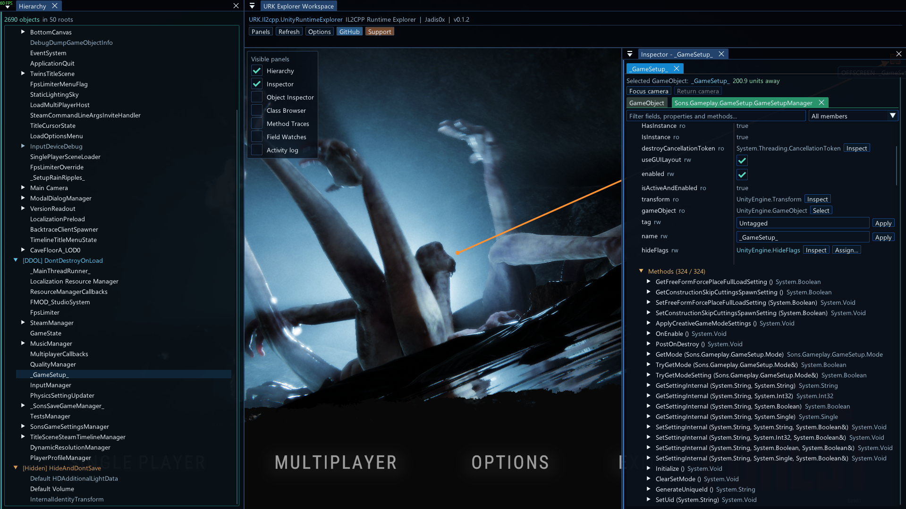

# UnityRuntimeExplorer

A live, in-game Hierarchy and Inspector for Unity games running through
[URKit](https://github.com/Jadis0x/URKit).



The current release supports **Windows x64 IL2CPP games**. Mono support is
planned for a future release.

## Features

- Browse loaded scenes, `DontDestroyOnLoad`, and hidden roots.
- Search, inspect, select, duplicate, and delete GameObjects.
- Edit GameObject state and local Transform position, rotation, and scale.
- Browse components, add components, and edit supported fields and properties.
- Inspect methods, invoke supported signatures, and view results or errors.
- Highlight the selected object in-game.
- Trace one selected native IL2CPP method with a bounded call history.
- Use a dockable ImGui workspace with DX11, DX12, and OpenGL rendering.

## Requirements

- A Windows x64 Unity game using IL2CPP.
- [URKit v0.1.0 or later](https://github.com/Jadis0x/URKit) installed in the game directory.
- A compatible URKit proxy DLL already selected for the target game.

## Installation

1. Install URKit in the game directory and confirm that it loads correctly.
2. Create a `Mods` folder next to the game executable if it does not already exist.
3. Copy `URK_Il2cpp_UnityRuntimeExplorer.dll` into that `Mods` folder.
4. Start the game and press `Tab` to toggle the Explorer menu.

If the mod does not load or a feature fails, inspect `URKit_logs.log` next to the
game executable.

## Compatibility

UnityRuntimeExplorer is a URKit loader plugin, not a standalone DLL. Do not
inject it directly. It supports IL2CPP only in this release and does not
guarantee compatibility with every Unity game or every game update.

## Building from source

Requirements: Windows x64, CMake 3.28 or later, LLVM/Clang, Ninja, and network
access for the first ImGui dependency download.

```powershell
cmake --preset clang-release
cmake --build --preset clang-release --parallel
```

The resulting DLL is written to `out/build/clang-release`.

## Roadmap

- Mono game support.
- Continued compatibility and usability improvements for the IL2CPP Explorer.

Copyright (c) 2026 Jadis0x. All rights reserved.
