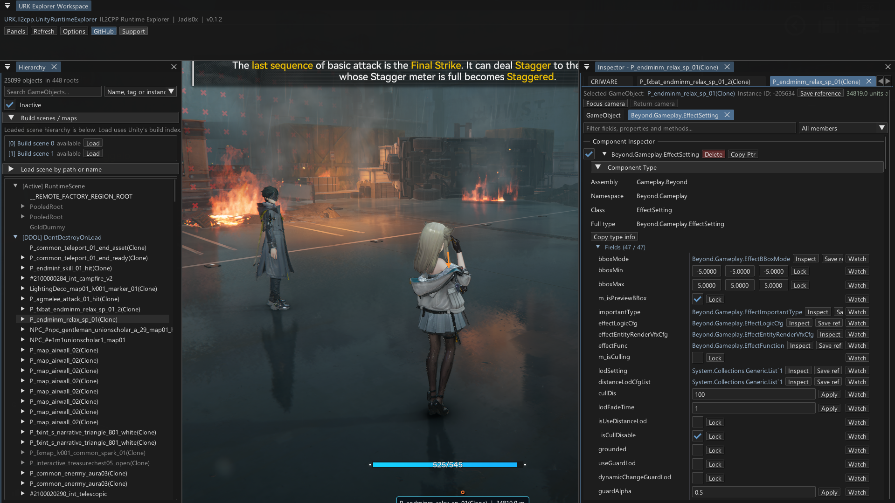
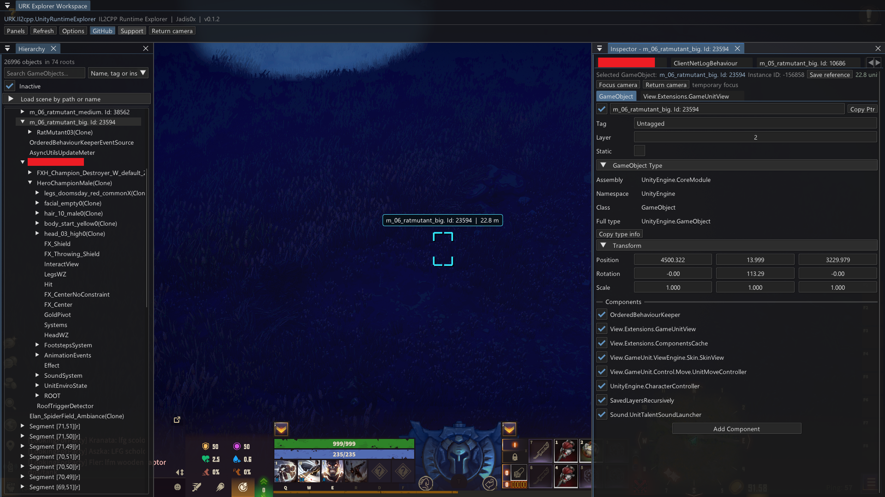

[](https://github.com/Jadis0x/UnityRuntimeExplorer/releases/latest)
[](https://github.com/Jadis0x/UnityRuntimeExplorer/releases)
[](https://github.com/Jadis0x/UnityRuntimeExplorer/stargazers)
[](https://discord.com/invite/XC7RUpGp6e)
[](https://github.com/Jadis0x/UnityRuntimeExplorer/issues)
[](https://github.com/Jadis0x/UnityRuntimeExplorer/blob/main/LICENSE)

# UnityRuntimeExplorer

UnityRuntimeExplorer is a runtime inspector for Windows Unity games. It loads
as a URKit mod and gives you a live view of the running process: scenes,
GameObjects, components, managed members, references, and selected runtime
values can be inspected without rebuilding the game.

The project is built on the [URKit](https://github.com/Jadis0x/URKit) native
C++ SDK. URKit provides the loader, Unity bindings, Mono/IL2CPP runtime access,
main-thread dispatch, hooks, and ImGui integration. UnityRuntimeExplorer adds
the Explorer UI and the inspection model on top of those services.





## Features

- Browse loaded scenes, hidden roots, and `DontDestroyOnLoad` objects.
- Search GameObjects by name, tag, or instance ID.
- Inspect GameObjects, components, fields, properties, and methods.
- Read and edit supported values while the game is running.
- Copy and paste local transforms from the Inspector or the Hierarchy context
  menu.
- Duplicate, delete, enable, disable, and add components when the target game
  and runtime support the operation.
- Follow managed object references and open returned objects in the Object
  Inspector.
- Invoke methods with supported signatures.
- Trace managed methods, including callers, arguments, return values, ABI data,
  and captured value types.
- Focus the camera on an object and highlight it in the game.
- Use a dockable ImGui interface with DX11, DX12, and OpenGL render paths.
- Investigate the live game from MCP clients through a separate helper,
  including managed type discovery and explicitly approved method tracing.

The Inspector resolves type and member information from the runtime rather than
using a game-specific type list. As a result, unsupported or unsafe operations
are reported as unavailable instead of being guessed.

## Runtime support

Two plugin binaries are produced:

```text
URK_Il2cpp_UnityRuntimeExplorer.dll   # IL2CPP games
URK_Mono_UnityRuntimeExplorer.dll     # Mono games
```

Use only the binary that matches the target game. The two plugins share the
Explorer UI and inspection code, but use different runtime backends.

Compatibility depends on the game's Unity version, generated metadata, runtime
exports, and the URKit version used to load the mod. Mono support also depends
on the embedding exports shipped by the game.

## Installation

Install [URKit](https://github.com/Jadis0x/URKit) first. Its repository contains
the current proxy, `Mods` folder, injector, and compatibility instructions.

### Proxy and `Mods` folder

1. Create a `Mods` folder beside the game executable.
2. Place the correct URKit proxy beside the executable. Preserve the original
   proxy filename and do not copy every proxy variant.
3. Place exactly one Explorer DLL in `Mods`:

   ```text
   URK_Il2cpp_UnityRuntimeExplorer.dll   # IL2CPP game
   URK_Mono_UnityRuntimeExplorer.dll     # Mono game
   ```

4. Start the game using the normal URKit launch path.
5. Press **F7** to open or close the Explorer.

### URKit injector

The optional `URKitInjector.dll` workflow loads the generated mod without a
proxy or a `Mods` folder:

1. Inject `URKitInjector.dll` into the supported Windows x64 game.
2. Select the URKit `.ini` file when prompted.
3. Select the Explorer DLL that matches the game's runtime.

Do not inject the Explorer DLL directly. It must be loaded by URKit.

If the Explorer does not appear, inspect `URKit_logs.log` beside the game
executable. The log usually identifies a wrong proxy name, an incompatible
backend, or a missing runtime export.

## Building from source

Builds are supported on Windows with CMake, Ninja, and Clang.

Requirements:

- Windows 10 or newer, x64
- CMake 3.28 or newer
- LLVM/Clang
- Ninja
- Network access for the first configure, which downloads ImGui and the other
  CMake dependencies

From the repository root:

```powershell
cmake --preset clang-release
cmake --build --preset clang-release --parallel
```

For a debug build:

```powershell
cmake --preset clang-debug
cmake --build --preset clang-debug --parallel
```

Release outputs are written to:

```text
out/build/clang-release/URK_Il2cpp_UnityRuntimeExplorer.dll
out/build/clang-release/URK_Mono_UnityRuntimeExplorer.dll
out/build/clang-release/URK_UnityRuntimeExplorer_McpServer.exe
```

Run the test suite with:

```powershell
ctest --test-dir out/build/clang-release --output-on-failure
```

## MCP integration

MCP support is optional. The MCP server is not embedded in the injected DLL.
Instead, the architecture has three parts:

1. The Explorer DLL runs inside Unity and owns all runtime access.
2. A local Windows named-pipe bridge carries bounded requests to the Unity main
   thread.
3. `URK_UnityRuntimeExplorer_McpServer.exe` is a separate MCP server that
   speaks JSON-RPC over stdio to the MCP client.

The helper discovers running Explorer instances through:

```text
%LOCALAPPDATA%\URK\UnityRuntimeExplorer\bridges
```

When one compatible game is running, it attaches automatically. If several are
running, pass `--game-pid <pid>` in the MCP client configuration.

The MCP helper publishes a complete discovery and control catalog. Explorer's
**Config** tab is the authoritative permission boundary; clients cannot grant
themselves capabilities through tool arguments or helper flags.

| Tool | Purpose |
| --- | --- |
| `runtime_status` | Runtime backend, scene, GC, revision, and diagnostic status. |
| `discover_runtime` | Search GameObjects and loaded managed types in one bounded discovery pass. |
| `hierarchy_search` | Bounded search by name, path, tag, instance ID, component, or dynamic behaviour type. |
| `find_game_objects` | Rank objects by name/path, components, dynamic behaviour types, scene, activity, and semantic role. |
| `get_selected_object` | Return the object selected in the Explorer. |
| `inspect_game_object` | Inspect identity, state, transform, and components. |
| `list_components` | List component types and opaque component references. |
| `read_member` | Read one explicitly requested field or readable property. |
| `inspect_managed_object` | Traverse fields on components and ordinary managed objects; property getters are opt-in. |
| `read_array` | Page through managed arrays while preserving reference elements as opaque tokens. |
| `decode_byte_array` | Copy and decode bounded byte arrays as MessagePack, JSON, text, compressed-payload detection, or hex. |
| `start_instance_scan` | Start a direct Unity-object query or a time-sliced reachable managed-object scan. |
| `get_instance_scan` | Read scan progress and page through discovered managed instances. |
| `search_types` | Search loaded Mono/IL2CPP types and assemblies. |
| `search_members` | Search fields, properties, and methods across bounded matching types. |
| `inspect_type` | Inspect fields, properties, methods, and signatures. |
| `list_method_traces` | List active and retained trace sessions. Consecutive identical calls are grouped. |
| `get_method_trace` | Read decoded calls, callers, arguments, and results. Grouped calls include their range and repeat count. |
| `build_call_graph` | Aggregate caller-to-target relationships from captured calls, including grouped repeats. |
| `get_activity_log` | Read recent Explorer activity and MCP audit events. |
| `build_reference_graph` | Build a bounded graph for the current selection. |
| `get_watch_history` | Return watched values and recent changes. |
| `export_diagnostic_bundle` | Export a diagnostic bundle to the fixed local directory. |
| `write_member` | Write fields or writable properties using bounded JSON values and opaque references. |
| `mutate_game_object` | Rename, retag, relayer, activate, transform, duplicate, or destroy a GameObject. |
| `manage_component` | Add, remove, or enable components. |
| `load_scene` | Load a build scene by index or name. |

Object, component, managed-object, scan, type, method, and trace references are opaque, bounded
tokens. Managed pointers, native addresses, raw ABI values, and runtime handles
are never sent to the MCP client.

The Config tab provides **Enable full access** and **Read-only preset** actions,
plus independent controls for automatic discovery, property getters, writes,
method tracing, managed invocation, and destructive Unity operations. Tool
calls are schema-validated, bounded, rate-limited, and audited. Raw pointers,
native-address execution, scripting, and assembly loading remain outside the
MCP surface because they bypass Explorer's managed object/lifetime model.

A typical investigation is:

```text
runtime_status
  -> discover_runtime / find_game_objects / search_members
  -> inspect_game_object / inspect_type / start_instance_scan
  -> inspect_managed_object / read_array / decode_byte_array
  -> start_method_trace
  -> reproduce the behavior in game
  -> get_method_trace / build_call_graph
  -> stop_method_trace
```

Ready-to-copy MCP client configuration examples are included for:

- [Claude Desktop](docs/examples/claude-desktop-config.json)
- [Codex](docs/examples/codex-config.toml)
- [Other stdio MCP clients](docs/examples/generic-mcp-config.json)

Replace the placeholder executable path in the selected example with the full
path to `URK_UnityRuntimeExplorer_McpServer.exe`. If multiple compatible games
are running, add `"--game-pid", "<pid>"` to the example's `args` list.

Client-specific setup instructions, security properties, troubleshooting, and
remote HTTPS/tunnel guidance are in [docs/MCP.md](docs/MCP.md).

## Compatibility and stability

Runtime inspection depends on the target game's metadata and runtime layout.
The same type or method can have a different ABI or managed representation in
another game. A member may also be unavailable because metadata was stripped,
the object was destroyed, or the operation is not safe to perform generically.

Tracing, live edits, method calls, and component operations can affect game
state or stability. Test with a restartable game session and keep backups of
any data that matters.

## Troubleshooting

### The Explorer does not open

- Confirm that URKit loaded the DLL matching the game's Mono/IL2CPP backend.
- Check `URKit_logs.log` beside the game executable.
- Confirm that the proxy filename and `Mods` layout match the URKit setup.
- Press **F7** after the game has reached its main menu or a loaded scene.

### MCP reports that no bridge is available

- Start the game with the Explorer DLL loaded before starting the MCP client.
- Confirm that the helper executable exists at the configured path.
- If more than one game is running, configure `--game-pid <pid>`.
- Check `%LOCALAPPDATA%\URK\UnityRuntimeExplorer\bridges` for a discovery
  record and inspect `URKit_logs.log` for runtime load errors.

### An MCP reference has expired

Run `find_game_objects` or `hierarchy_search` again after a scene-generation
change. Object and component references survive ordinary hierarchy refreshes;
graph references remain tied to the hierarchy revision that produced them.

### A member cannot be read

The member may be a property with side effects, stripped from metadata, opaque
to the generic inspector, or attached to a destroyed object. The tool returns
the failure instead of substituting a default value.

## Project status

UnityRuntimeExplorer is under active development. Compatibility reports and
small, reproducible examples are especially useful when opening an issue.
Include the following information:

- game runtime: IL2CPP or Mono;
- Unity version, if known;
- the relevant section of `URKit_logs.log`;
- the type or method signature involved; and
- what the Explorer displayed and what you expected to see.

## License

Copyright (c) 2026 Jadis0x. All rights reserved.
